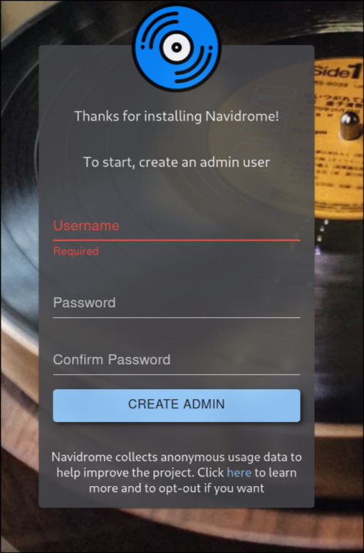
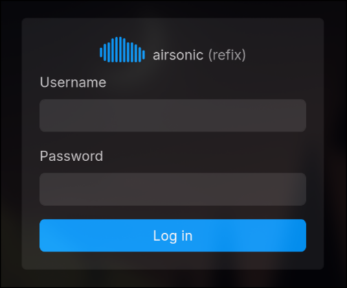

Alright, you've got Ubuntu installed and running smoothly. Now comes the exciting part - turning your server into an actual music streaming powerhouse. We're going to install Navidrome, and I'm going to show you exactly how to do it the right way.

## What is Navidrome?

Navidrome is lightweight, open-source music streaming server that actually understands music collectors. Unlike Spotify's algorithm-driven approach, Navidrome respects your music organization and gives you complete control over your listening experience.

Here's what makes it awesome:
- **Subsonic-compatible** - Works with tons of mobile apps
- **Web interface** - Stream from any browser
- **Fast and lightweight** - Perfect for our setup
- **Respects your organization** - Your folders become playlists
- **No phone-home nonsense** - Your music stays on your server

## Why Docker? (For the Newbies)

Before we dive in, let me explain why we're using Docker instead of just installing Navidrome directly.

Think of Docker as a shipping container for software. Just like how shipping containers work the same way whether they're on a truck, train, or ship, Docker containers work the same way on any Linux system.

**Why this matters for us:**
- **Consistency** - Navidrome will work exactly the same way every time
- **Easy updates** - Pull new version, restart container, done
- **Clean uninstalls** - Don't like it? Delete the container, no traces left
- **Isolation** - If something breaks, it won't mess up your whole system
- **Reproducible** - Share your config with others, they get identical setup

It's like having a perfect installation recipe that works every single time.

## Step 1: Prepare Your Music Library

Before we install anything, let's get your music organized. You need somewhere to put your music files where Navidrome can find them.

### Create Your Music Directory

Let's keep this simple and put your music in your home directory - no need for system-wide `/mnt` paths that require sudo permissions.

```bash
# Create a directory for your music in your home folder
mkdir -p ~/music

# Create some basic structure
mkdir -p ~/music/Artists

# Check it was created
ls -la ~/music
```
### Get Some Music On There

You need to get your music files onto the server. Here are a few ways to do it:

**Option 1: Copy from another computer over SSH**
```bash
# From your local machine (replace paths, user and IP as needed)
scp -r "/path/to/your/music/folder" $USER@192.168.1.100:~/music/
```

**Option 2: Use a USB drive**
```bash
# Plug in USB drive, then mount it
sudo mkdir /mnt/usb
sudo mount /dev/sdb1 /mnt/usb

# Copy music files (using $USER variable so you can copy-paste)
sudo cp -r /mnt/usb/Music/* ~/music/
sudo chown -R $USER:$USER ~/music/

# Unmount when done
sudo umount /mnt/usb
```

## Step 2: Create Your Docker Compose Configuration

Docker Compose lets us define our entire setup in a simple text file. Create a directory for your Navidrome setup:

```bash
# Create directory for Navidrome
mkdir -p ~/navidrome
cd ~/navidrome

# Create the docker-compose.yml file
nano docker-compose.yml
```

Now paste this configuration into the file:

```yaml
services:
  navidrome:
    image: deluan/navidrome:latest
    container_name: navidrome
    ports:
      - "4533:4533"
    environment:
      - ND_ENABLESHARING=true
    restart: unless-stopped
    volumes:
      - "./data:/data"
      - "${HOME}/music:/music:ro"
      
  airsonic-refix:
    ports:
      - "23880:80"
    image: tamland/airsonic-refix:latest
    container_name: airsonic
    restart: unless-stopped
    environment:
      - SERVER_URL=http://localhost:4533
```

**Note:** This configuration uses `${HOME}` and `$USER` variables so you can copy-paste these commands without having to replace your username everywhere.

Let me explain what this does:

**Navidrome container:**
- `image: deluan/navidrome:latest` - Uses the official Navidrome Docker image
- `ports: "4533:4533"` - Makes Navidrome available on port 4533
- `ND_ENABLESHARING=true` - Lets you share music with others
- `"${HOME}/music:/music:ro"` - Maps your music folder (using $HOME variable so it works for any user)
- `restart: unless-stopped` - Automatically restarts if it crashes

**Airsonic Refix container:**
- This is an alternative web interface for Navidrome that looks way better
- `ports: "23880:80"` - Available on port 23880
- Uses the same Navidrome backend, just prettier frontend

Save the file (Ctrl+X, then Y, then Enter).

## Step 3: Start Everything Up

Time to fire up your music server:

```bash
# Make sure you're in the navidrome directory
cd ~/navidrome

# Start the containers
docker compose up -d

# Check if everything is running
docker compose ps
```

You should see both containers running. If something's wrong, check the logs:

```bash
# Check Navidrome logs
docker compose logs navidrome

# Check Airsonic logs
docker compose logs airsonic-refix
```

## Step 4: Access Your Music Server

If everything worked, you now have two ways to access your music:

**Navidrome (original interface):**
Open your browser and go to: `http://your-server-ip:4533`

**Airsonic Refix (prettier interface):**
Open your browser and go to: `http://your-server-ip:23880`

### First Login

When you first access Navidrome, it will ask you to create your admin account. This is actually better than having default credentials - you set up your own secure login right from the start.
 
 

1. **Create your admin account:**
   - Choose a username (doesn't have to be "admin")
   - Set a strong password
   - This becomes your main administrator account



2. **For Airsonic Refix:** Use the same Navidrome credentials you just created

## Step 5: Initial Setup

### Configure Your Music Library
Navidrome should automatically scan your `~/music` folder. If it doesn't find your music:

1. Go to Settings → Library
2. Check that the music folder path is correct
3. Click "Full Rescan" if needed

### Test Your Setup
1. Browse your music collection
2. Try playing a song
3. Test both the Navidrome and Airsonic interfaces
4. See which one you prefer (I personally love Airsonic Refix)

## Step 6: Mobile Access

The beauty of Navidrome is that it works with tons of mobile apps:

**Android:**
- **DSub** (my favorite)
- **Ultrasonic**
- **Subsonic**

**iOS:**
- **play:Sub**
- **Amperfy**
- **Subsonic**

Just point any Subsonic-compatible app to:
- **Server:** `http://your-server-ip:4533`
- **Username/Password:** Your Navidrome credentials

## Troubleshooting Common Issues

**Can't access the web interface?**
- Check if the containers are running: `docker compose ps`
- Make sure the firewall allows the ports: `sudo ufw allow 4533` and `sudo ufw allow 23880`
- Verify your server's IP address: `ip addr show`

**No music showing up?**
- Check file permissions: `ls -la ~/music`
- Make sure your music files are in common formats (MP3, FLAC, M4A)
- Try a manual rescan in Settings → Library

**Can't play music?**
- Check browser console for errors (F12)
- Try a different browser
- Verify music files aren't corrupted

## Managing Your Server

### Useful Docker Commands

```bash
# View running containers
docker compose ps

# View logs
docker compose logs -f navidrome

# Restart everything
docker compose restart

# Stop everything
docker compose down

# Update to latest versions
docker compose pull && docker compose up -d
```

### Updating Navidrome

When new versions come out:

```bash
cd ~/navidrome
docker compose pull
docker compose up -d --force-recreate
```

Docker will automatically download the new version and restart your containers.

## Next Steps

You now have a fully functional music streaming server! But we're not done yet. In upcoming posts, I'll cover:

- **Advanced Navidrome configuration** - Playlists, users, and sharing
- **Setting up external access** - Stream your music from anywhere
- **Backup strategies** - Protecting your setup and music
- **Music library management** - Using Beets for perfect organization
- **Mobile app recommendations** - The best clients for your phone

## Quick Reference

### Important URLs:
- Navidrome: `http://your-server-ip:4533`
- Airsonic Refix: `http://your-server-ip:23880`

### Important Directories:
- Music: `~/music`
- Navidrome config: `~/navidrome`
- Container data: `~/navidrome/data`

### Default Credentials:
- Username: `admin`
- Password: `admin` (change this!)

Congratulations - you're now streaming your own music, on your own terms, with your own server. No algorithms, no ads, no corporate oversight. Just your music, the way you want it.

Welcome to the world of self-hosted music streaming!